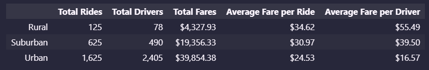
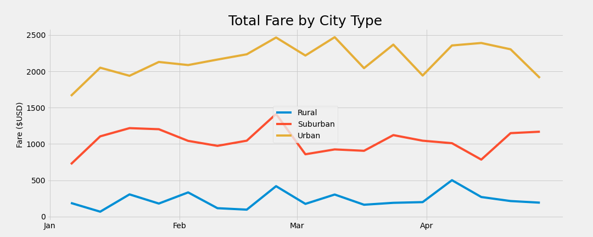

# PyBer_Analysis

## Overview

The purpose of analysing the city_data and ride_data was to determine key metrics that allow a ride-sharing company, PyBer which is run by V. Isualize, to compare rural, suburban, and urban areas with each other. The assignment specifically directs us to find and place in a summary date frame the following metrics:
- Total Rides in the given data set
- Total drivers and drivers per region type
- Total fares per region type
- Average fares per ride
- Average fare per driver
      
The assignment also asks us to find the total weekly fares for each region type in the form of a line graph. We are also expected to understand the data and come up with 3 recommendations to improve the company pay structure.

## Results

After creating the Pyber summary Data Frame, the following differences and similarities were noticed:
- Urban areas have a vast majority of total rides ordered with 1,625 total rides while rural and suburban areas only have 750 rides combined.
- Urban areas have the most amount of drivers with 2,405 on the street. Rural and suburban drivers only have 568 drivers combined.
- Urban areas brought in $39,854.38 which is 62.7% of all fares. Rural makes up 6.8% of fares while suburban make up 30.5%.
- Urban areas have much lower rates per fare as compared to rural and suburban areas.
- Average fare per driver is higher in rural areas with $55.49 being made per fare. It is only $16.57 per fare in urban areas.

The "Total Fare by City Type" graph shows the weekly revenue throughout January through April. The graph shows that:
- As expected, the urban areas consistently brings in $2000-2500 a week, the most amount of weekly revenue.
- suburban areas bring is a middle amount of revenue of about ~$1000 a week.
- Rural areas bring in the least amount of weekly revenue averaging about ~$250 a week.

## Summary

Using the data extracted from the data sets provided I was able to come up with 3 recommendations that aim for a more uniform pay structure for drivers as well as increasing riders and drivers in rural and suburban areas.

1. The vast difference between the income per ride for urban drivers and rural drivers can pull drivers towards the urban areas to either or transfer to other ride-sharing services. Adopting a per-mile payment system as well as a flat bonus per ride could help equalise the pay disparity. The flat bonus should be higher in rural areas as they have fewer riders.
2. Consider increasing the fare in urban areas and decreasing the fares in rural areas to help pull in more people in rural areas to use our apps while making the urban operation more profitable. 
3. Factors such as wait time and driving quality needs to be further researched in rural areas to help understand if there is more of a demand to be met. this can also be implemented in urban and suburban areas to gain more market share.
